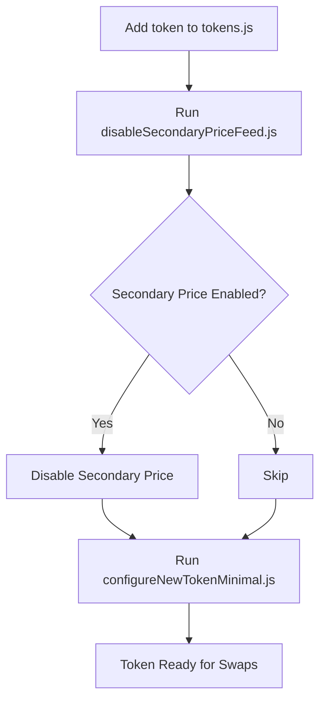

# GMX v1 Token Configuration Deep Dive

## Overview

This document captures the complete analysis and findings from investigating GMX v1 token configuration, specifically for swap-only functionality without leverage trading or limit orders.

## Key Findings

### 1. Swap-Only Mode Requirements

**DEFINITIVE ANSWER**: For GMX v1 swaps mode only (no leverage/limit orders), you only need to configure:
- Token whitelisting in the Vault contract
- Primary price feed (Chainlink) configuration in VaultPriceFeed
- **NO keeper infrastructure required**
- **NO FastPriceFeed required** (if `isSecondaryPriceEnabled = false`)

### 2. Understanding the Architecture

#### Vault Contract (`contracts/core/Vault.sol`)
- The `swap()` function only requires:
  - `whitelistedTokens[_tokenIn]` = true
  - `whitelistedTokens[_tokenOut]` = true
  - Price feed data for both tokens
- No keeper interaction needed for basic swaps
- Uses `useSwapPricing = true` temporarily during execution

#### VaultPriceFeed Contract (`contracts/core/VaultPriceFeed.sol`)
```solidity
// Price resolution flow:
function getPrice() {
    // 1. Get primary price (Chainlink)
    price = getPrimaryPrice(_token, _maximise);
    
    // 2. Optional: Apply AMM price
    if (_includeAmmPrice && isAmmEnabled) {
        price = getAmmPrice(_token, _maximise, price);
    }
    
    // 3. Optional: Apply secondary price (FastPriceFeed)
    if (isSecondaryPriceEnabled) {
        price = getSecondaryPrice(_token, price, _maximise);
    }
}
```

#### FastPriceFeed Contract (`contracts/oracle/FastPriceFeed.sol`)
- Implements `ISecondaryPriceFeed` interface
- Set as `secondaryPriceFeed` in VaultPriceFeed
- Only used when `isSecondaryPriceEnabled = true`
- Requires keeper infrastructure to update prices

### 3. Keeper Dependencies

Keepers are only required for:
- **OrderBook operations**: Executing limit/stop orders
- **FastPriceFeed updates**: Updating secondary price feed
- **Position management**: Liquidations and position updates
- **yALP vault**: Compounding rewards (separate from core GMX)

Keepers are NOT required for:
- Basic token swaps through Vault
- Primary price feed (Chainlink) operations

### 4. Original vs Minimal Configuration

#### Original `configureNewToken.js` does:
1. Sets timelock buffers to 0
2. Configures FastPriceFeed governance
3. Sets FastPriceFeed tokens array
4. Configures token in Vault (via timelock)
5. Configures price feed in VaultPriceFeed (via timelock)
6. Restores timelock buffers
7. Manages FastPriceFeed admin transfers

#### Minimal `configureNewTokenMinimal.js` does:
1. Sets timelock buffers to 0 (only for needed operations)
2. ~~Configures FastPriceFeed~~ ❌ REMOVED
3. ~~Sets FastPriceFeed tokens~~ ❌ REMOVED
4. Configures token in Vault (via timelock) ✅ KEPT
5. Configures price feed in VaultPriceFeed (via timelock) ✅ KEPT
6. Restores timelock buffers ✅ KEPT
7. ~~FastPriceFeed admin transfers~~ ❌ REMOVED

## Implementation Details

### Scripts Created

1. **`configureNewTokenMinimal.js`**
   - Streamlined token configuration without FastPriceFeed
   - Supports single token or batch configuration
   - Command-line parameter support
   - Automatic skip for already whitelisted tokens

2. **`disableSecondaryPriceFeed.js`**
   - Utility to check and disable secondary price feed
   - Shows current configuration status
   - One-time setup requirement

3. **`README-minimal-token-config.md`**
   - User guide for the scripts
   - Requirements and verification steps
   - Clear explanation of supported vs unsupported features

### Token Configuration Flow



### Required Token Parameters

```javascript
{
  // Essential for swaps
  address: "0x...",          // Token contract address
  decimals: 18,              // Token decimals
  tokenWeight: 10000,        // Weight in basis points (affects pool composition)
  minProfitBps: 150,         // Minimum profit in basis points
  maxUsdgAmount: 50000000,   // Max USDG amount that can be minted
  isStable: false,           // Is this a stablecoin?
  isShortable: false,        // Can be shorted (set false for swap-only)
  
  // Price feed configuration
  priceFeed: "0x...",        // Chainlink oracle address
  priceDecimals: 8,          // Decimals from price feed
  stable: false,             // Price feed stable flag
  
  // Not needed for minimal setup
  fastPricePrecision: 1000,  // ❌ Only for FastPriceFeed
  maxCumulativeDeltaDiff: 0.1 * 10 * 1000 * 1000, // ❌ Only for FastPriceFeed
}
```

## Verification Commands

After configuration, verify success with:

```javascript
// 1. Check token is whitelisted
const isWhitelisted = await vault.whitelistedTokens(tokenAddress);
console.log("Token whitelisted:", isWhitelisted); // Should be true

// 2. Check price feed is configured
const priceFeed = await vaultPriceFeed.priceFeeds(tokenAddress);
console.log("Price feed:", priceFeed); // Should be Chainlink address

// 3. Check secondary price is disabled
const isSecondaryEnabled = await vaultPriceFeed.isSecondaryPriceEnabled();
console.log("Secondary price enabled:", isSecondaryEnabled); // Should be false

// 4. Test getting price
const price = await vaultPriceFeed.getPrice(tokenAddress, true, false, false);
console.log("Token price:", price); // Should return valid price
```

## Common Issues and Solutions

### Issue: Transaction fails with "VaultPriceFeed: invalid price feed"
**Solution**: Ensure the Chainlink price feed address is correct for your network

### Issue: Swap fails with "Vault: !whitelisted"
**Solution**: Token not properly whitelisted. Re-run configuration script.

### Issue: Price seems outdated
**Solution**: This is expected without FastPriceFeed. Prices update only when Chainlink updates.

### Issue: High slippage on swaps
**Solution**: Without FastPriceFeed, you rely solely on Chainlink's update frequency. Consider enabling secondary price feed for production.

## Production Considerations

### When to Use Minimal Configuration
✅ **Good for:**
- Development and testing
- Low-volume swaps
- Networks where FastPriceFeed keepers aren't available
- Simple DEX functionality

❌ **Not recommended for:**
- High-volume production deployments
- Leveraged trading platforms
- Scenarios requiring price manipulation protection
- High-frequency trading environments

### Security Implications

Without FastPriceFeed:
- No protection against Chainlink oracle manipulation
- No high-frequency price updates
- Larger potential for sandwich attacks
- Reliance on single price source

Consider these risks when deciding whether to use minimal configuration.

## Script Usage Reference

### Configure Single Token
```bash
npx hardhat run scripts/peripherals/configureNewTokenMinimal.js --network sonic usdc
```

### Configure All Tokens
```bash
npx hardhat run scripts/peripherals/configureNewTokenMinimal.js --network sonic
```

### Disable Secondary Price Feed
```bash
npx hardhat run scripts/peripherals/disableSecondaryPriceFeed.js --network sonic
```

### Get Help
```bash
npx hardhat run scripts/peripherals/configureNewTokenMinimal.js --help
```

## Conclusion

For swap-only functionality in GMX v1:
1. FastPriceFeed is completely optional
2. Keepers are not required
3. Only Vault whitelisting and Chainlink price feeds are essential
4. The minimal configuration significantly reduces operational complexity

This approach is perfect for development, testing, or deployments where full GMX functionality isn't needed.